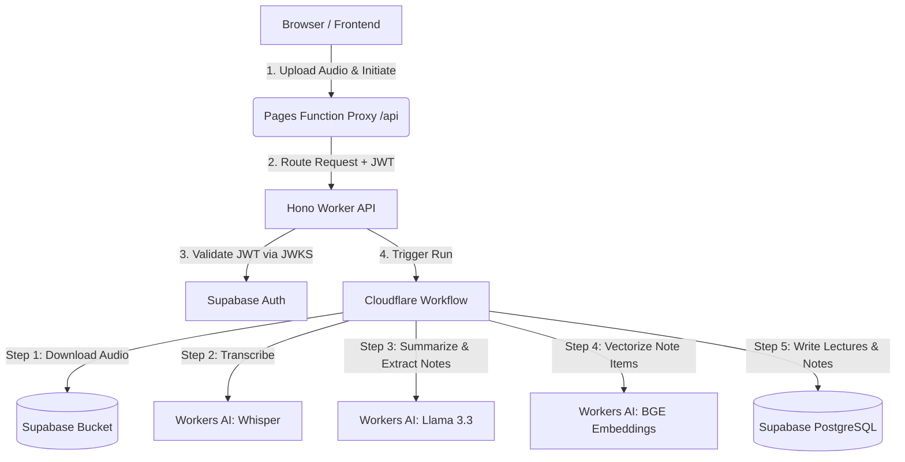

# Lecture AI

An AI-powered lecture note-taking, summarization, and semantic search application. Users can record audio, generate transcription and key concepts asynchronously using Cloudflare Workflows, and query their aggregated notes using vector similarity searches.

---

## Repository Structure

The project is structured as a monorepo containing the following components:

```
├── frontend/                   # React + Vite SPA using Spectre.css (Cloudflare Pages)
│   ├── functions/api/          # Cloudflare Pages Functions (API Proxy Layer)
│   ├── src/                    # React codebase (components, context, pages, utils)
│   └── public/                 # Static assets
│
├── lecture-ai-workflow/        # Asynchronous processing pipeline (Cloudflare Worker)
│   ├── src/                    # Worker source files (Hono routes, workflow steps, controllers, services)
│   ├── wrangler.jsonc          # Worker deployment configuration
│   └── worker-configuration.d.ts
│
└── queries/                    # Database migrations and configuration scripts
    ├── similarity_search.sql   # match_notes stored procedure (pgvector RPC)
    ├── lectures_rls.sql        # Row Level Security (RLS) policies for lectures table
    └── notes_rls.sql           # Row Level Security (RLS) policies for notes table
```

---

## Features & AI Models

- **Speech-To-Text Transcription**: Automatically transcribes uploaded audio files using `@cf/openai/whisper`.
- **Lecture Summarization**: Generates long-form markdown summaries of transcripts using `@cf/meta/llama-3.3-70b-instruct-fp8-fast`.
- **Concept Extraction**: Isolates key concepts, terms, and definitions from lectures.
- **Note Vectorization**: Transforms extracted concepts into 768-dimensional text embeddings using `@cf/baai/bge-base-en-v1.5`.
- **Secure Vector Database**: Stores notes, lectures, and embedding vectors securely in **Supabase** (scoped to users using Postgres Row Level Security).
- **Notes Assistant (Chat/Q&A)**: Uses cosine similarity searches to extract relevant note context, prompting the `@cf/meta/llama-3.3-70b-instruct-fp8-fast` LLM to answer user questions using only their notes.

---

## System Architecture



---

## Database Configuration (Supabase)

Make sure you run the scripts in the `/queries` folder inside your **Supabase SQL Editor** before running the application:

1. **Similarity Search Function (`queries/similarity_search.sql`)**: 
   Creates the `match_notes` RPC stored procedure used for cosine similarity lookups in pgvector.
2. **Lectures RLS Policies (`queries/lectures_rls.sql`)**: 
   Restricts reading, inserting, and deleting lecture rows to the authenticated user owning the data.
3. **Notes RLS Policies (`queries/notes_rls.sql`)**: 
   Restricts notes queries to the authenticated user.

---

## Setup & Environment Variables

### 1. Backend (`/lecture-ai-workflow`)
Create a `.dev.vars` file in `/lecture-ai-workflow` to store sensitive environment variables:
```properties
SUPABASE_URL=https://<your-project-id>.supabase.co
SUPABASE_PUBLISHABLE_KEY=<your-anon-publishable-key>
SUPABASE_SECRET_KEY=<your-service-role-key-admin>
SUPABASE_JWKS_URL=https://<your-project-id>.supabase.co/auth/v1/.well-known/jwks.json
SUPABASE_DB_PASSWORD=<your-database-password>
```

### 2. Frontend (`/frontend`)
Create a `.env` file in `/frontend` to configure frontend parameters:
```properties
VITE_SUPABASE_URL=https://<your-project-id>.supabase.co
VITE_SUPABASE_ANON_KEY=<your-anon-publishable-key>
```

---

## Local Development Installation

### 1. Start the Backend Worker
Ensure you have Wrangler installed and are logged in.
```bash
cd lecture-ai-workflow
npm install
npm run dev
```
The backend server will launch at `http://127.0.0.1:8787`.

### 2. Start the Frontend dev server
In a separate terminal:
```bash
cd frontend
npm install
npm run build
npx wrangler pages dev dist
```
The frontend dev server will launch at `http://127.0.0.1:8788`.

---

## Deployment Guide

### 1. Deploy the Backend Worker
Configure your secrets in the Cloudflare dashboard or using the CLI:
```bash
cd lecture-ai-workflow
npx wrangler secret put SUPABASE_URL
npx wrangler secret put SUPABASE_PUBLISHABLE_KEY
npx wrangler secret put SUPABASE_SECRET_KEY
npx wrangler secret put SUPABASE_JWKS_URL
npx wrangler secret put SUPABASE_DB_PASSWORD
```
Then deploy the worker:
```bash
npm run deploy
```
Copy the generated production URL (e.g. `https://lecture-ai-workflow.<username>.workers.dev`).

### 2. Deploy the Frontend Pages
To deploy manually using the CLI to the production environment:
```bash
cd frontend
npm run build
npx wrangler pages deploy dist --branch main
```

#### Configuring Environment Variables for Cloudflare Pages:
Under your **Cloudflare Pages project dashboard** -> **Settings** -> **Environment Variables**, you must set:
- `VITE_SUPABASE_URL` (Supabase project URL)
- `VITE_SUPABASE_ANON_KEY` (Supabase publishable key)
- `WORKER_HOST` (Set this to the production worker URL copied during step 1, e.g., `https://lecture-ai-workflow.<username>.workers.dev`)